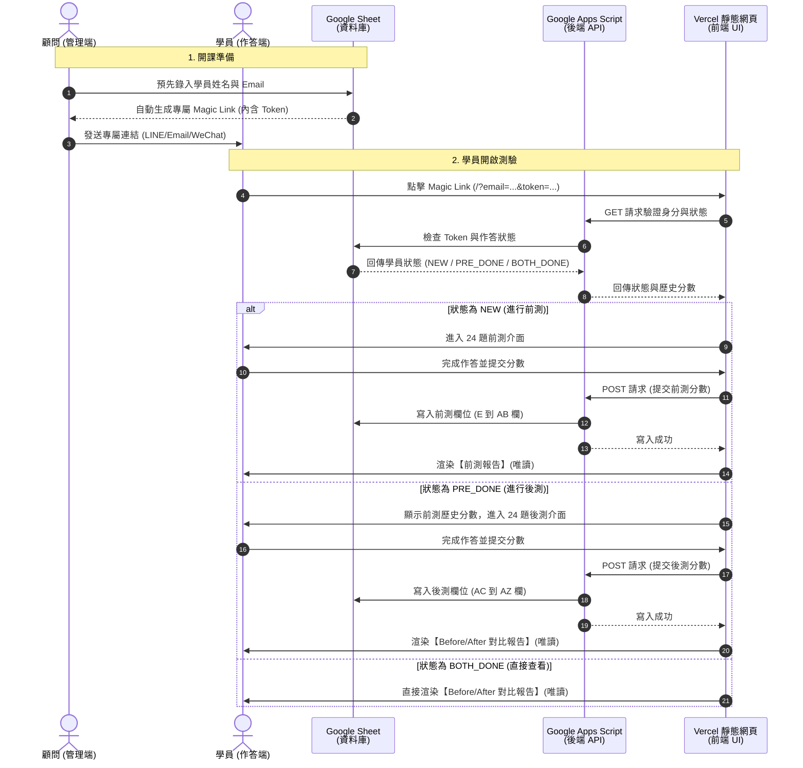

# 專屬精力管理評測系統：客製化訂閱制系統企劃與實作計畫書

本企劃書旨在為顧問團隊設計一套符合**「低成本、高安全性、低維護難度、快速交付」**原則的精力管理評測系統。
系統架構採用**「一客一庫 (One Repo per Client)」**的 GitOps 模式部署於 Vercel，並以 **Google Sheets + Apps Script** 作為免費且防篡改的後端資料庫，搭配 **Magic Link (免登入安全連結)** 解決方案防止郵件濫用與安全漏洞。

---

## 🔗 參考範本網址 (Reference Template URLs)
*   **前端報告展示 Demo (Vercel)**: https://energy-survey-demo-hank.vercel.app/
*   **前台作答邏輯 Staging (Azure)**: https://energysurvey.azurewebsites.net/

---

## 🎯 專案目標與商業定位
1.  **快速客製化交付**：針對不同客戶（預估 5-6 個獨立顧問或企業），只需複製專案儲存庫，在 5 分鐘內即可完成專屬品牌色、Logo 與題目的調整並上線。
2.  **訂閱狀態極簡控制**：無需撰寫會員收費閘道與付費狀態同步。顧問只需在 GitHub 或 Vercel 端一鍵啟用/停權，或在 Google Sheet 直接鎖定帳號。
3.  **零伺服器與資料庫成本**：全系統完全部署在 Vercel Free Tier 與 Google Sheets，營運成本為 $0，且完全防範郵件轟炸攻擊。

---

## ⚙️ 系統架構與資料流向

---

## 🧱 系統模組規劃 (System Modules Plan)

本系統切分為**「前端客製網頁」**與**「後端雲端試算表」**兩大核心板塊，各自模組化設計如下：

### 一、 前端客製網頁模組 (Frontend Modules)

| 模組名稱 | 子功能描述 | 實現方式與邏輯 |
| :--- | :--- | :--- |
| **1. 驗證與分流模組** (Gateway & Verification) | *   讀取網址 URL 參數。 *   發送 API 查詢身分。 *   根據狀態進行頁面跳轉。 | 解析 `window.location.search` 中的 `email` 與 `token`。 *   未帶參數：進入模擬體驗模式 (Demo Mode)。 *   驗證失敗：跳轉至錯誤訊息面板。 *   驗證成功：引導至對應的歡迎畫面。 |
| **2. 問卷作答引擎模組** (Survey Engine) | *   載入題目陣列。 *   進度條控制。 *   單選題按鈕與流暢轉場。 | *   讀取 `app.js` 的配置陣列，每次僅顯示一題。 *   提供 0-5 分選項按鈕，點擊後觸發微動畫並自動進入下一題。 *   支援「上一題」按鈕以供學員修改。 |
| **3. 圖表分析報告模組** (Report & Analytics) | *   繪製雷達圖。 *   計算總分進步幅度。 *   產出診斷文案。 *   鎖定唯讀防篡改。 | *   使用 `Chart.js` 繪製雙層雷達圖（前測為灰色，後測為綠色）。 *   計算公式：`Lift = After - Before`。 *   根據四大維度得分高低，動態判斷「最低維度」與「進步最多維度」。 *   移除所有可點選的編輯器，確保報告呈現為純文字與圖片。 |
| **4. 品牌客製配置模組** (Theme Configuration) | *   CSS 變數更換主色調。 *   更換品牌 Logo 與圖片。 | *   在 `styles.css` 的 `:root` 宣告主色調變數（如 `--teal`, `--orange`）。 *   可直接置換本地圖檔（如更換為企業客戶的 Logo），代碼結構完全不變。 |

### 二、 後端資料庫與 API 模組 (Backend Modules)

| 模組名稱 | 子功能描述 | 實現方式與邏輯 |
| :--- | :--- | :--- |
| **1. API 路由與安全防護** (API Routing & CORS) | *   解析 GET / POST 請求。 *   限制跨網域請求來源。 | *   使用 Google Apps Script 的 `doGet(e)` 與 `doPost(e)`。 *   設定回應 Header 中的 `MimeType.JSON`，以支援 CORS 跨網域傳輸。 |
| **2. 身分狀態查詢模組** (Status Query) | *   在 Sheet 中检索學員。 *   比對防猜測 Token。 *   回傳當前評測狀態。 | *   依據輸入的 Email 尋找對應的 Row。 *   驗證學員輸入的 Token 是否與資料表 D 欄 (Token) 吻合。 *   檢查前測與後測欄位是否有數值，判斷回傳 `NEW`、`PRE_DONE` 或 `BOTH_DONE`。 |
| **3. 資料寫入與紀錄模組** (Data Writer) | *   寫入測驗分數。 *   更新最後異動時間。 | *   前測提交：寫入該學員列的 E 到 AB 欄。 *   後測提交：寫入該學員列的 AC 到 AZ 欄。 *   寫入時，自動將 A 欄（Timestamp）更新為當前時間。 |
| **4. 免代碼管理面板** (No-Code Admin Sheet) | *   顧問手動調整分數。 *   批次建立名單。 *   學員進度追蹤看板。 | *   直接在 Google 試算表中操作。顧問可直接修改學員拼錯的名字、或手動調整分數。 *   可使用 Google Sheets 原生的「篩選器」與「樞紐分析圖」，一鍵拉出全班平均成績。 |

---

## 📊 資料庫試算表欄位設計 (Database Schema)

客戶的 Google Sheet 分頁命名為：`學員名單`，其欄位分配規則如下：

*   **A 欄 (Timestamp)**: 學生最後提交時間 (由後端寫入)
*   **B 欄 (Email)**: 學員信箱 (Unique KEY, 顧問手動錄入)
*   **C 欄 (Name)**: 學員姓名 (顧問手動錄入)
*   **D 欄 (Token)**: 隨機安全碼 (顧問手動錄入，或在 Sheet 中設定公式自動生成)
*   **E 欄 ~ AB 欄 (Pre-test Q1 ~ Q24)**: 前測 24 題原始分數 (0-5)
*   **AC 欄 ~ AZ 欄 (Post-test Q1 ~ Q24)**: 後測 24 題原始分數 (0-5)

---

## 🛠️ 專案實作文件列表

當我們啟動執行時，將在本地建立以下四個檔案作為主模板：

1.  **後端部署範本**：[google-apps-script.js](file:///C:/Users/manma/.gemini/antigravity/scratch/energy-survey-master/google-apps-script.js) (已建立)
2.  **前端主頁面**：[index.html](file:///C:/Users/manma/.gemini/antigravity/scratch/energy-survey-master/index.html) (已建立)
3.  **品牌設計樣式**：[styles.css](file:///C:/Users/manma/.gemini/antigravity/scratch/energy-survey-master/styles.css) (已建立)
4.  **前端核心邏輯**：[app.js](file:///C:/Users/manma/.gemini/antigravity/scratch/energy-survey-master/app.js) (待撰寫)

---

## 🧪 測試驗證計畫 (Verification Plan)

本系統開發完成後，將在本地進行三階段功能測試：
1.  **純前端模擬測試 (Mock Mode)**：
    網址不帶參數或帶上 `?demo=true` 時，前端將跳過 API 發送，直接使用內建的模擬學員資料（如 Webber Hsu, Before 58, After 80）運作，用於確認雷達圖與作答切換的流暢度。
2.  **API 介面與安全性測試**：
    呼叫錯誤的 Token 或未註冊的 Email，測試後台是否會正確阻擋，前端是否正確顯示「驗證失效」的面板。
3.  **全功能串接測試**：
    在測試試算表上記錄一個名單，點擊產出的 Magic Link，完成前測 -> 寫入試算表 -> 再次點選連結進行後測 -> 寫入試算表 -> 看到 Before/After 雷達圖對比。
